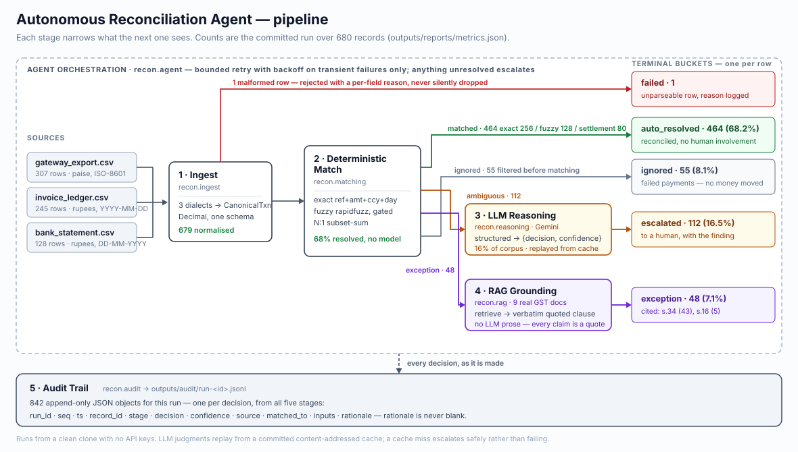

# Architecture

Phase 1 is complete; this describes what was actually built. Measured results are
in [`../outputs/reports/summary.md`](../outputs/reports/summary.md).

## Pipeline Flow

Ingest -> Deterministic Match -> LLM Reasoning (ambiguous cases only) -> RAG Grounding (exceptions only) -> Agent Orchestration (retry / escalate / log) -> Audit Trail Output

Each stage narrows what the next one sees. That is the core cost-control
decision: the deterministic layer resolves 68% of the corpus, so only **16%** of
records ever reach the LLM and **7%** reach RAG.

## Components

### 1. Ingest
- Reads transaction records from 3 sources: gateway export (307 rows), invoice
  ledger (245), bank statement (128) -- each with its own amount unit and date format
- Normalizes schema across sources
- Validates input; malformed records routed to failure-handling path, not silently dropped

### 2. Deterministic Matching Layer
- Exact match: reference id + amount + currency + day (ambiguous keys deferred)
- Fuzzy match: rapidfuzz-scored amount/date/name/ref; a currency or amount
  disagreement is capped below the confident threshold
- Settlement N:1: bank credit vs the batch of gateway payments (subset-sum)
- Output buckets: `matched` / `unmatched-ambiguous` (→ LLM) /
  `unmatched-exception` (→ RAG) / `ignored` (failed payments, filtered pre-match)
- 100% bucket accuracy vs ground truth on the current corpus; resolves ~68%
  deterministically

### 3. LLM Reasoning Layer
- Input: `unmatched-ambiguous` records only (not the full dataset — cost/latency control)
- Google Gemini (`gemini-3.6-flash`) via `google-genai`, `response_schema` for
  structured output: `{decision, matched_candidate_id, confidence, rationale}`
- Content-addressed replay cache (`data/llm_cache/`, committed) — the pipeline
  runs offline with no API key; a cache miss falls back to a safe `unsure`/escalate
- Low confidence, or a confident match with a residual amount variance, escalates
  to a human — with the model's finding attached, never forcing money to move

### 4. RAG Grounding Layer
- Input: `unmatched-exception` records only (refund debits, bank charges)
- Corpus: 9 real GST documents (CGST Act sections + Rules + a circular) in
  `data/policy/`; chunked, embedded with local `sentence-transformers`
  (`all-MiniLM-L6-v2`), stored in ChromaDB (`data/rag_index/`, built on first run)
- Output: a `GroundedExplanation` — summary + recommended action + **verbatim
  quoted citations** (doc title + source). Retrieval + template, no LLM prose, so
  every claim traces to a quote a controller can check
- refund debit → s.34 credit-note rule · bank charge → s.16 / s.17 / r.38 ITC

### 5. Agent Orchestration
- `run_pipeline()` coordinates the full loop and reduces every input row to one
  terminal bucket: `auto_resolved | escalated | exception | ignored | failed`
- Bounded retry with exponential backoff on transient failures only; a malformed
  request is not retried
- Anything unresolved escalates — with the LLM's finding, or the reason one could
  not be obtained, attached
- **Two** injected failure modes demonstrated end to end (see below)

### 6. Audit Trail
- `src/recon/audit/logger.py` — append-only JSONL, one object per decision:
  `run_id, seq, ts, record_id, stage, decision, confidence, source, matched_to,
  inputs, rationale`
- `rationale` is never blank; ambiguous decisions carry the scored candidates so
  the LLM stage (and a human) can see what was weighed
- This is the artifact judges will actually inspect — treat it as a first-class output, not incidental logging
- `scripts/show_audit.py` renders a run as a readable walkthrough: one
  representative decision of each kind, plus the full chain for records that
  passed through several stages. The committed output is
  [`../outputs/reports/audit_walkthrough.md`](../outputs/reports/audit_walkthrough.md)
  — readable from a clean clone, since the per-run JSONL itself is regenerated
  rather than committed. `--record <id>` follows a single record end to end.

## Failure modes handled

| Injected | Where | Behaviour |
|----------|-------|-----------|
| Malformed row | ingest | Rejected with a per-field reason, logged, run continues → `failed` |
| LLM API timeout | reasoning | Retried with backoff and absorbed; retry appears in the trail. Exhausted retries escalate that record only |
| *(unplanned)* policy store unavailable | RAG | Exceptions still reported, without citations, rather than failing the run |

## Stretch (Phase 3, not core)
- CV/OCR ingestion for scanned invoices, feeding into step 1
- DL-based confidence calibration, replacing/augmenting LLM confidence scoring in step 3

## Diagram
[`ARCHITECTURE.svg`](ARCHITECTURE.svg) — hand-authored SVG, so it diffs as text
and needs no rendering toolchain. Counts on it are the committed run's, not
illustrative.
